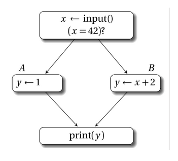
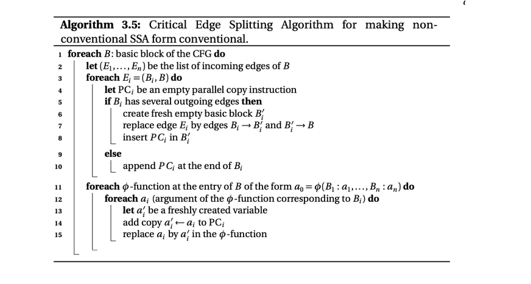
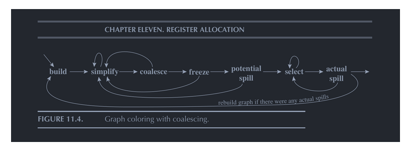
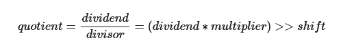
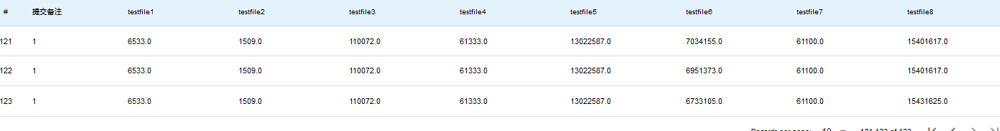

# LLVM优化文档
## 写在最前面
本文档是随敲随写的，最后整理时较为匆忙，优化着实是太过折磨，因此若文笔过于晦涩且不够周到，还望海涵！

## 一.mem2reg

#### 0. 写在前面
**在sysY中定义的变量称作原始变量，而在LLVM中的一个个变量我会称作虚拟变量(后续很有可能会统称为变量...但实际不一样)，定义和赋值的概念不再区分**。

本优化不考虑全局变量和数组，仅针对单值int和指针(本质上是一字节的值)进行优化。我们最初的LLVM已经是SSA单赋值形式，而mem2reg这步，对于用LLVM为中间代码的我来说，应当是对原先的LLVM打散再重构的过程。

首先要明确，最初的LLVM是单赋值且单使用(除去Alloc指令)，一个原始变量被拆成过多的虚拟变量，因为我们使用的每一个虚拟变量都是从活动记录中LOAD取出，即一个虚拟变量被单赋值的同时也仅被使用了一次。我们现在要依据每个原始变量的def-use链(一个变量的生命周期，从被定义，到被使用，到再次被定义结束)改造成单赋值多使用的形式(同样是将原始变量拆成多个虚拟变量，但是仅在定义时拆)，通过这第一步，我们便可以消去一部分的访存指令。
但由此会引发一个重大的问题，借用教程的图图。

在分支汇总处，一个原始变量的取值会取决于数据从哪条分支上流入，上图AB块中的两个y我们称作y1和y2，print块中的y并非定义而是使用，那么它的取值便成了未知数，我们用 y3 = phi [A, y1], [B, y2] 这条指令对y进行一次定义，y3成为此时y的唯一取值。

接下来的工作便是以**基本块**为最小单位找到**在哪里插入phi指令**，进而找到**哪些变量该使用phi指令的结果**。最后结果是**使得每一个原始变量在指令的任何地点有唯一的虚拟变量取值**。
#### 1. 计算基本块前驱与后继结点
依据基本块跳转指令来记录每一个基本块的前驱和后继基本块们就可以，记录基本块前驱与后继。进入节点无前驱，退出节点(最后一条为return语句的基本块)无后继。
#### 2. 计算被支配节点（支配集合）
首先定义如下:
1. 支配（dominate）：如果CFG中从起始节点到基本块y的所有路径都经过了基本块x，我们说x支配y，按照这个定义，每一个节点都支配自己。

2. 严格支配(strict dominate)：如果x支配y，且x不等于y，那么x严格支配y。

3. 直接支配者（immediate dominator, idom）：严格支配n，且不严格支配任何严格支配 n 的节点的节点(直观理解就是所有严格支配n的节点中离n最近的那一个)，我们称其为n的直接支配者。

接下来我们计算每个节点被哪些节点支配。
**Lengauer-Tarjan**算法较为复杂，我们采用**迭代数据流算法**，流程如下:
1. 将起始节点设为r，初始化为仅被自己支配
2. 其余起始支配节点初始化皆为被全部节点支配。每个基本块保存一个HashMap<BasicBlock, Boolean>用作记录被支配关系。
3. 每次迭代取前驱结点的被支配集合的交集与自身的并，直至集合无变化，此时得到各节点支配关系，注意这不是支配树。

所谓a严格支配b，对符号x而言，即b中的第一次定义x之前的值完全由a的最后一次定义来决定，不存在任何歧义。因此显然自己无法严格支配自己。

#### 3. 计算直接支配者
根据定义(严格支配n，且不严格支配任何严格支配 n 的节点的节点)计算，我们已经求得支配n结点的全部节点，只需要遍历一遍即可找到藏在其中的直接支配节点。

每个节点的直接支配者是其父节点，根据此关系我们构造出了**支配树**。

#### 4. 计算支配边界
首先明确为何计算支配边界，一个节点的支配边界代表着支配范围的边界，在该节点对变量的定义会在边界处会产生歧义(即这个定义只是多个取值的可能一种取值)，因此我们需要计算支配边界来找到插phi的位置。
我们已经求得每个节点的直接支配者，采用如图算法。

简单解释该算法：我们遍历有向图中每一条边(a指向b)，从两个节点最近的位置，即一条边开始，逐渐沿a的直接支配者往上，直至a能够直接支配b，在此之前的遍历到的所有节点，其支配边界都该包含b。

注意，**自己可以是自己的支配边界**，考虑 0 --> 1 --> 2 --> 1，即出现回边时，自己基本块的定义也可能不由自己决定。
#### 5. 插入phi节点
核心算法如图：我们得到了支配边界后，此时以原始变量作为最小单位，记录下原始变量在哪些基本块中被定义过(此时需要与符号表配合，见改造符号表一节)
，进而找到基本块集合的支配边界，由于我们要在支配边界上插入定义的phi指令，支配边界也便成了定义的基本块，因此需要将支配边界也纳入基本块集合中，同时记录支配边界们，直至找到**闭包**，定义基本块集合不再变化。

这时我们求得了待插phi的支配边界集合，但是要明确的是，**经过上述算法得到的是可能插入phi的位置，并非一定插入**，由于我们的文法支持各处定义，在一个基本块插入phi值时可能出现该变量未被定义的情况，这是不应该的，因此在得到插入phi的基本块集合后，需再次判断该变量在该基本块是否存在定义。**这一条限制是我们SysY文法的限制，而非一般算法中给出**。

在重命名前，即使Phi指令未被填全，但是该指令的Value(即该变量在基本块中的新定义)已然存在。新增的Phi填充完毕，意味着此时变量定义已然完备，一个变量在任何位置都具备了变量唯一性，重命名只需要做两件事，计算Phi指令流入的Value，为一开始找不到定义的假标签找到属于它的Value。

试做证明：**插入phi后，若在当前基本块x仍找不到定义，则其真正的定义一定在直接支配者y中**。
当前基本块找不到定义，说明当前基本块未定义，且未插phi，说明该基本块未被当作支配边界，则该基本块定义唯一来自其直接支配者y。
#### 6. 重命名phi
我们由第三步可得知节点的父节点，根据父节点推出每个节点的子节点，构建支配树，为接下来DFS做准备。

我们需要DFS支配树，基本块a是基本块b的直接支配者并不意味着基本块b中的变量由a中的变量直接决定，而是由a中的变量和将b作为支配边界的基本块们中的变量共同决定。

重命名需要三步，第零步需要判断当前插入的phi的合理性(即是否沿每条前驱块都能找到对应定义)，第一步**为phi指令的每一条数据流找到归属**，第二步**重命名该基本块内在生成phi之前无法得到准确赋值的被使用的变量**(一开始以假标签的形式填充)。

第一步：为phi值添加基本块流，需要保证其每一个前驱基本块都要为PHI提供一条数据流，对于每一前驱块，沿其直接支配者找到最近的该原始变量定义，将其填入Phi指令中。这一步的正确性**基于DFS支配树**，保证遍历到一节点时，其直接支配者的phi指令都已装配完毕。
第二步：重命名假标签同理，首先判断在Phi指令的插入后能否在当前基本块找到定义，若找到则重命名假标签为该phi值，若找不到，则沿其直接支配者找到最近的定义即可。上述寻找过程一定都能找到，因为在插入PHI以后，已经**确保了每个原始变量在每一时刻的虚拟变量的唯一性**。

         int main(){
             int a1 = 1;
             if (a1 > 3) {
                a1 = a1 + 3;
             }
             return 0;
         }
考虑如上情况a1应该被唯一确定，if内a1并非处在a1的决策边界处，dfs支配树。

给出官方的算法，由于本人到这一步看不太明白，于是上文均是自创，完备性有待商榷。
#### 7. 附：改造符号表
尝试过多种方法，考虑过新建一张LLVM专用的符号表，思来想去觉得麻烦，于是便复用Value构建了一张符号表，每个Value记录其原始变量(Symbol)，再通过一些数据结构记录每个基本块内存在的Value，Value和Symbol应当是多对一的关系。

## 基本块合并
这一步应用在CFG之后，计算支配关系之前，因为涉及到对基本块的删除，主要工作有二。

1. 将非连通基本块删除
2. 将相邻基本块(该基本块有且只有一个前驱且该前驱有且只有当前基本块一个后继)和二为一，指令相融合

由于我们在上文已把基本块的关系构建完毕，接下来处理较为容易。

### 值得注意的地方
#### 基本块间的关系是一个双向链表，在合并以及删除时应注意前驱节点和后继节点的修正。
具体来说，设被合并删除的基本块为a，合并的基本块为b，则a不再是b唯一的后继节点，而a的后继节点成为b新的后继节点；a的后继节点们的前驱节点也不再是a，而替换为b!
#### 不只是指令的copy，还涉及到变量定义位置的改变。
合并基本块会导致定义位置紊乱，可能无法沿支配树找到最近Value，需要额外的操作。由于满足一对一关系，合并的块一定是被合并的块的直接支配者!
1. 我们可以遍历被合并的块全部指令，用合并块的定义表进行匹配，将能匹配上的假标签替换为合并的块的定义Value，由于存在先后关系，定义表中保存的变量定义是最后一次定义，而被合并块存在的假标签一定是在该基本块第一次定义之前出现的，因此匹配正确性得到保证。
2. 将被合并块的定义符号表(IrSymbolTable)转移到合并块的定义符号表，若合并块中存在该变量定义，则替换(因为被合并的在合并的之后); 若不存在，则加入。

## 死代码删除
### 1. 概念：
程序包含的一些代码可能并不会被运行或者不会对结果产生影响，那么我们称这种代码为死代码。我们将不会被运行到的称为不可达代码，将不会对结果产生影响的代码成为无用代码。删除无用或不可达代码可以缩减IR代码，可使程序更小、编译更快、执行也更快。
### 2. 死函数删除
构造函数调用链，删除没有使用过的函数。不过这一步只能减少生成的代码，并不会减少执行的cycle。使用BFS计算出有价值函数的闭包，其余删除。
### 3. 死代码删除
我们目前认为的有价值指令有：br, ret, call, store（有待商榷，需要进一步做内存分析，全局变量的store可以无脑加，局部变量的store取决于后续有无使用它的，需要涉及到公众子表达式删除等问题），其中store会在后文做一些微不足道的优化。

采用逆推的形式，将所有有价值指令标记，再将有价值指令的操作数标记....大体思路同死函数删除，使用BFS计算出有价值指令闭包，其余指令删除。

## 局部公共子表达式删除
局部子表达式删除的正确性建立在基本块内指令的顺序执行。若是在全局范围内优化，则需要考量基本块执行顺序的问题，出现哈希冲突时并不代表其中存在可以优化的项，例如在两个分支中出现了

    分支1：c1 = a + b, d1 = c1 + a；
    分支2：c2 = a + b, d2 = c2 + a；

此时我们不能将c2优化为c1，因为c1在这条分支中不会被计算。由于时间原因，我们只针对部分指令进行局部子表达式删除，包含add,sub,mul,div,getelementptr,cmp。该优化以每条指令为最小单元，站在基本块视角进行，步骤如下：
1. 对于每个BasicBlock初始化一个哈希表

2. 对每条指令，获取它的操作数和操作符，根据操作数和操作符计算哈希值，需要特别考虑add，mul，cmp三类指令，他们存在着多种等价形式，add和mul将操作数颠倒同样等价，而对cmp而言，例如a>b和b<a等价...

3. 扫描基本块内全部指令，计算哈希值，如果哈希表中已经存在该值，那么我们直接将BasicBlock里后续用到该value的地方全部替换为哈希表内存的value，否则将哈希值及对应的value存入哈希表

## 常量折叠与传播
1. 提前计算好操作数为常数的表达式，针对add,sub,mul,div,cmp等进行了常量折叠，缩减计算指令。
2. 只进行了较为简单的复杂折叠，诸如 0 * a, 1 * a, 0 + a, a - 0, 0 / a 等相邻情况的简单优化。

# MIPS优化
## 后端消PHI
这一步说是优化，然而是LLVM经历过mem2reg优化后不得不做的一步。

消PHI即将PHI指令消去，换句话说，PHI指令的Value值应该保留，但后面的数据流应当通过Move指令消去。LLVM是有规则的，对于基本块B，若其有多个前驱的基本块B1,B2...且B中存在phi指令，我们可以在B1->B之间添加新的基本块B' ，新添加的基本块内只有一种指令，即move指令。

参照教程内思路，首先遍历全部基本块，找到入口存在phi指令基本块B(存在Phi指令意味着其一定有两个及以上前驱节点)，遍历其每个前驱节点Bi，若其拥有超过一个后继节点，则(Bi, B)称作一对关键边，在这之间创建一新基本块B',若Bi仅B一个后继节点，则后续在Bi结尾进行。

创建好基本块后，遍历B中所有PHI指令，对于 %x = phi((%b1 %v1), (...))，找到其前驱基本块b1对应的Move指令插入位置(新基本块or末尾)，插入指令 %x = move %v1，对于phi内其他数据流同样操作即可。

**需要特别说明的是：move是自己定义的假指令，对标mips里的move，其中保存两个Value记为target与source。**
如此我们通过加入大量move指令，完成了对LLVM的消Phi工作，在后续我们会尝试将move合并以缩减多余的move指令。

## 图着色寄存器分配（核心）
mips优化中最核心的一步，经历消phi后，我们便可以着手生成mips代码。生成时进行图着色寄存器分配优化。

在之前的阶段当中我们都假定了有无限个寄存器作为虚拟变量，而实际上mips后端的寄存器有限，经过大量摸索后寄存器分配如下：
zero, at不参与分配；v0, v1用作机动寄存器(即使用后立即释放，不会引起任何冲突)，用于承接立即数与在超过两个操作数的指令中进行中间计算，同时v1还被设置用来存放图着色后溢出的节点，并立即存入内存中，这两个寄存器不参与分配；
sp,fp,ra,gp寄存器用于维护堆栈，全局变量，返回地址等，不可分配；a0~a3用作函数传前四个参数，不可分配(这四个寄存器有过考量，最终实践证明传参时需要用来中间过渡的寄存器，否则由于传参寄存器冲突导致访存开销过大)，不参与分配；其余全部共20个寄存器参与图着色寄存器分配。

### 1. 计算活跃变量
应用在课内学过的计算活跃变量的方法，我们以基本块为单位计算出每个基本块内全部指令in和out集。计算方法为一个基本块中由下至上由out倒推in，而基本块内最后一条指令的out集由其后继节点们第一条指令的in集的并集决定，如此迭代计算，直至每条指令的in和out集合不再变化。为减少迭代次数，可以考虑从出口节点开始遍历。如此我们计算出了多个活跃变量集合，也即是**变量冲突的多个时刻**。

具体而言针对每一条指令，in集等于out集加上该指令的操作数节点，再减去该指令节点，如下图算法所示：

### 2. 构造冲突图Build
接下来开始图着色寄存器分配，整体算法如图所示：

一个活跃变量集合里包含的元素两两冲突，彼此间都会形成一条无向边，我们在Value类内记录每个节点的邻接矩阵，遍历所有的活跃变量集合，得到冲突图，同时需要记录下move指令的两个节点，在后续可尝试合并。

冲突图代表着节点之间的冲突关系，存在边的两节点无法共用同一寄存器，我们进行启发式的图着色算法来为每个节点分配寄存器，最终目的为**在生成mips之前，每个虚拟变量被分配到了有且仅有一个唯一的寄存器**。

### 3. 简化Simplify
我们删除冲突图中度数小于K(20)的点，简化冲突图，将其入栈，产生更多的图着色机会，因简化步骤而入栈的节点**一定可以分配到寄存器**。
### 4. 合并Coalesce
move指令的两端节点本质相同，可进行保守式的合并，若合并后的度数总和小于K，则进行合并, 即二节点共用同一寄存器，将被合并的点彻底移除冲突图(需要记录下合并的点，为后续分配寄存器时能够得到合并点分配的寄存器)，同时注意维护现有图的邻接边关系；若合并后总度数大于K，则我们不进行合并，因为合并后可能会产生新的溢出节点，得不偿失。
### 5. 冻结Freeze
反复执行简化和合并的步骤，直至图中节点无法改变。
### 6. 溢出Spill
无法合并与简化时，将度数大于等于K的结点标注为不可分配寄存器，然后从冲突图中去除，将其入栈，因溢出步骤而入栈的节点**不一定能分配到寄存器**。溢出节点后简化了冲突图，会暴露出更多的合并和简化机会，如此反复，直至冲突图为空。
### 7. 选择Select
当冲突图为空时，开始从栈中挨个取结点，重新生成冲突图，为在简化时入栈的结点分配寄存器，将溢出时入栈的结点置入不可分配的集合。

最后尝试将不可分配寄存器集合的结点取出尝试为其分配寄存器(由于move等原因可能存在为其分配寄存器的可能)，若当真无法分配，则进行标记，将其转化为活跃范围较小的变量，并进行重新开始。
### 8. 重新开始Restart
如果无法进行着色的集合不为空，那么则需要改写程序，为这些变量在内存当中分配空间，并且在每次使用需要将其从内存当中取出。

这一步骤是最关键的一步，也是笔者改造最多的一步，关键在于如何理解教程中这段话：

*每次修改需要存进内存当中，这种情况下，溢出的临时变量会转变为几个活跃范围很小的新的临时变量，这个时候需要重新进行活跃分析、寄存器分配，直到没有溢出和简化为止（通常只需要迭代一两次）。*

冲突图中的节点有两种可能，一种是指令节点，另一种是函数的形参节点，假设某节点是溢出的节点，意味着**该节点应当在出现后立刻存入内存中，将其从活跃变量流中杀死，而使用到该变量节点时从对应地址中取出，再使用**。

出现：若节点是函数形参，则在函数最开始便已经出现，因此也在函数最开始添加指令，若为前四个参数则将对应的A寄存器存入内存，若为后续形参，则我们会在调用函数时处理将形参存入内存的过程，而并非在函数头执行；
若节点是指令节点，则在其被赋值的时刻出现，我们需要在下一条紧接Store指令，将其存入内存当中。

而为溢出节点分配寄存器本人采取了两种方式
1. 对溢出节点作标记后**重新开始**：该节点被使用时不再纳入活跃变量集合中，而与之绑定的store指令的操作数(也就是该溢出节点)仍需要纳入活跃变量集合，此时我们将**该溢出节点活跃范围缩小**，进而重新进行图着色分配，直至再无溢出节点。
2. 将溢出节点寄存器设置为机动寄存器V1：由于溢出节点在store后寄存器会立刻释放，不如使用机动寄存器进行转存，如此确保一趟图着色便可分配完毕，避免了重新开始的步骤，最后采用第二种方法，正确性无误。

以下是coding时一些随笔:
1. 从哪取：偏移量如何设置，偏移量来自两个地方，一个是数组的声明，一个是我们放不下的虚拟变量，先装我们的虚拟变量，翻译mips时实时填入二维数组。
2. 全局变量该如何记录，需不需要应急寄存器，全局变量符号出现在Load(无需缓冲)和GTR处(涉及计算，需要缓冲)，使用V1作为缓冲即可。
3. 最后每一个变量都会被分配一个绝对不会产生冲突的寄存器，生成Mips时直接对照寄存器无脑灌入即可。
4. 问题：即使有限次迭代可以保证分配好寄存器，但仍然存在死循环的可能性，当一个变量V无法分配寄存器，而将其转换在前面load出来时，由于load也需要一个寄存器承接，因此即使V不作为活跃变量在寄存器内流向更前面的定义处，而在当前处(load的out)处仍存在冲突的可能性，这时需要**重新开始**。

### 9. 经过图着色寄存器分配后的结果
每一条指令Value(或称为结果Value)都唯一确定分配好了一个寄存器，而使用的Value除常数外有两种情况。

1. 同样在寄存器中
2. 由于寄存器冲突而存在内存中，此时备注好了相对于FP的偏移，使用机动寄存器取出即可

接下来按照指令类型翻译为mips即可，相较于优化前，这一步是轻松许多的。

### 10. 生成mips
整体较为ez，有两个重点：
1. 对地址的处理：我们令alloc指令的结果为**数组的绝对基地址(fp + offset)**，getelementptr指令结果为**绝对基地址+偏移量**，同样为绝对地址，而对于溢出节点的使用采用当前fp的相对地址寻值，秉持上述原则，在处理地址问题便没有歧义了。
2. 对函数传参的处理：由于图着色后，形参和实参都分配好了寄存器，无可避免的会出现传递的当前形参的寄存器后续的实参还要用到，此时无法直接move的情况，此时需要一些算法来规避影响，最为简单的方法是用一块内存空间作为缓冲，实参先存入内存中，形参再从内存中调取。然而这会产生大量存取内存指令，因此这也是为何要令A0~A3作为传参缓冲寄存器的理由。

## 乘除法优化
### 1. 乘法优化
特判乘数是否为2的倍数，若是2的倍数可改为左移指令。
### 2. 除法优化

除法优化即将除法改造为乘法和右移指令。

上述公式需要满足：
1. 被除数为正数
2. 除数为常数且为正数

根据不等式计算出乘数m和右移量l，由于我们需要保证被除数为正数且生成指令时无从得知被除数的正负，于是尝试人为构造了if语句并创建了两个新基本块用于被除数正数和负数的情况。
### 3. 取模优化
使用恒等式将取模转化为乘除操作即可(a % b = a - a / b * a)。

## 优化Store指令
进行内存分析，删除一些无用的store指令：例如有时我们会在load之前多次对同一个地址进行store，那么显然只有最后一个store是有效的，前面的store指令可删除，删除后可能会暴露新的优化空间，再次进行死代码删除。

## 全局指令移动（超简化版）
指令移动时有如下要求：
1. 操作数在循环中不变，为定值
2. 移动不会产生**副作用**，比如涉及存入内存等指令，若提出循环外，则可能没进循环，却由于外提而执行这条指令导致影响下文，这种即是产生了副作用。
3. 为变量赋值也是一种疑似会产生副作用的操作，经过了死代码删除后，留下的被赋值的变量一定会在下文中被用到，外提还需要对phi指令做一些处理，比如循环外对i赋值，循环内也对i赋值(但满足操作数不变)，此时在循环结束后使用i值，正常应该是使用phi将两个数据流汇总，而外提后变不太对劲了....

我们首先通过深度优先遍历CFG找回边得到**处于循环内的基本块**，我们只针对循环内的基本块中某些语句做出前提，一是由于循环外指令再怎么前提也不会产生正面优化，二是指令前提也会产生活跃变量范围增大，溢出节点增多等副作用，需要权衡考虑。

为简单起见，只将偏移量为常数的gpr指令尝试前移至基地址的定义位置之后，若使用全局变量基地址则前移至入口基本块处，如此可避免多次重复计算访存地址。

正确性：一是gpr内操作数不变，二是gpr得到的结果是唯一的(Gpr的结果并非是原始变量，而是临时变量，不会对phi流产生影响)，一定不会存在副作用。

经实际检验，在第七个竞速测试点得到了大量优化。

## Bug
### 第五个点wrong answer： 将gp设置为0x10000000即可，错误原因可能是全局变量爆了data段
### 第六个点做了辣么多的优化，仅优化掉了几十万，排名40多，是否有一些简单的优化情况没有考虑到？
### 数组初始化若是0不可以不保存，因为当多次调用时对应的地址将可能不再是0，此时需要用0刷新地址值。

## 总结
最终八个点得分如下所示，排名除第六个点外均位于20名附近，而第六个点来到50+。第六个点较为反常，出现了分配给其的寄存器越多，cycle反而越高的情况，mem执行较多，
猜测是使用了较深的递归。

总而言之，从一个月前正式着手进行优化，再到如今优化后代码来到1w+行，即使循环外提等关键优化未来得及细细琢磨，排名似乎也不是很理想，这场优化之路至此也将走向终点。
这是一次充满艰辛的苦痛旅程，也是一次锻炼自己的绝佳机会，我收获到了不只是编译优化方面还有图论算法等等的知识，也练就了自己去看懂伪代码，看不懂就自己造算法的见山开山，见水渡水的执着心态，最后再次感谢坚持一路走来的自己，感谢这学期和我
一同讨论编译的朋友们，也感谢课程组和老师们，感谢他们为我们带来了不逊色于coos的编译实验。纵使心中万般不舍，也不得不为这学期的努力画上句号，编译再见噜！

最后，我想说编译在我心中不愧是oo的promax升级版，最后的最后献上我的类图。

## 期末
前中后更改，增添文法后，首先词法解析 语法解析需要更改，