# 参考编译器
本人的编译器在宏观架构设计上参考了教程提供的pl-0编译器以及部分往届学长编译器(特别感谢于敬凯学长)的实现，pl-0是一个用于演示编译原理的教学工具，通常用于学术环境中教授编译器设计的基础概念。
## 一. 总体结构
教程提供的代码展示了编译器的核心部分，包括数据类型的定义、全局变量、一些基本的过程和函数。编译器的结构遵循典型的编译流程，包括词法分析、语法分析、语义分析以及代码生成。

## 二. 接口设计
编译器的主要接口通过一系列的过程和函数构成，它们处理不同的编译任务。例如，error 函数用于错误报告，getsym 用于获取下一个符号，gen 用于生成指令等。这些接口通过参数和返回值与编译器的其他部分通信。

## 三. 编译器操作逻辑
该编译器的运行逻辑遵循以下步骤：

1. 词法分析：getch 和 getsym 协作，从源文件中读取字符并识别出符号。
2. 语法分析：递归下降的语法分析器根据语法规则进行解析，并可能调用 error 以报告语法错误。
3. 符号表管理：enter 函数用于将新的标识符加入到符号表，position 函数用于在符号表中查找标识符。
4. 语义分析：在语法分析的同时，检查变量声明和作用域规则。
5. 代码生成：根据解析出的语法结构，gen 函数生成对应的指令序列。
## 四. 编译器数据类型
该编译器定义了多种数据类型与数据结构用来存储编译信息。

1. symbol 类型：定义了一系列用于语法分析的符号，包括各种运算符、标识符、保留字等。
2. alfa 类型：定义了一个字符数组，用于存储标识符。
3. objecttyp 枚举：表示不同种类的符号表实体，如常量、变量、过程。
4. symset 类型：是一个集合类型，用于表示可能出现的符号集合。
5. fct 枚举：表示编译器生成的虚拟机指令的操作码。
6. instruction 记录：表示虚拟机指令，包含操作码、层级和地址。 

# 本编译器总体设计
本编译器针对SysY文法的源代码生成Mips架构目标代码，编译器采用JAVA语言编写，总代码行数约11000行，净行数8800余行，共计约100个类(文件)，完整实现功能的同时做出了较多编译优化。
## 一. 总体结构
本编译器采用经典的前端-中端-后端架构，前端负责词法分析，语法分析，符号表建立，错误处理部分，中端负责生成中间代码LLVM以及中间代码优化，后端负责生成目标代码MIPS以及少量的后端优化。
## 二. 接口设计
本编译器秉持着高内聚，低耦合的思想，将核心功能完整封装在了各个子模块，而主类Compiler仅保留调用子模块的接口，编译步骤跟随调用的接口依次为：
1. clearAnnotation: 删除代码中的注释
2. parseCompUnit: 语法分析，依据语法规则生成语法树，同时伴随着词法分析与生成符号表，并进行错误处理。
3. printWrongInfo: 若代码出错，则打印报错信息并暂停编译过程
4. genLLVM: 生成中间代码LLVM，并将其逻辑结构保存在IrModule中
5. optimizeLLVM: 进行中间代码优化，通过调节IrModule中的FLAG可随时关闭/开启优化
6. setMipsModule/genMips: 将中间代码的结构依次装填入后端Mips的结构中，并生成最终的目标代码Mips

## 三. 文件说明
文件树如下所示：
1. FrontEnd：前端代码包
   1. Core: 内含语法分析器与词法分析器，是前端解析的精髓
   2. Info: 存储解析中遇到的错误，单词等相关信息
   3. NonTerminal: 存储文法内各个非终结符节点
   4. SymbolTable: 存储符号表
2. MidEnd: 中端代码包
   1. IrInstructions: 存储LLVM的相关指令
   2. SymbolTable: 代码优化时用到，存储为mem2reg而重新构建了中间代码符号表
   3. Tools: 一些工具类
   4. IrCore: 内含Value, User, IrGlobal, IrFunction, IrBasicBlock, IrModule等LLVM中端经典架构类
3. BackEnd: 后端代码包
   1. MipsInstructions: 存储Mips的相关指令
   2. MipsCore: 完全模仿LLVM架构，构建出的Mips下的一套架构，用于将LLVM架构装配到后端，并进行Mips目标代码生成，其中MipsInstructionBlock为核心，它的作用是将一条LLVM语句翻译为多条Mips语句。
4. Compiler: 编译器启动类
# 词法分析设计文档
## 零. 任务目标
设计并实现词法分析程序，从源程序中识别出单词，记录其单词类别和单词值。
## 一. sysY文法的单词
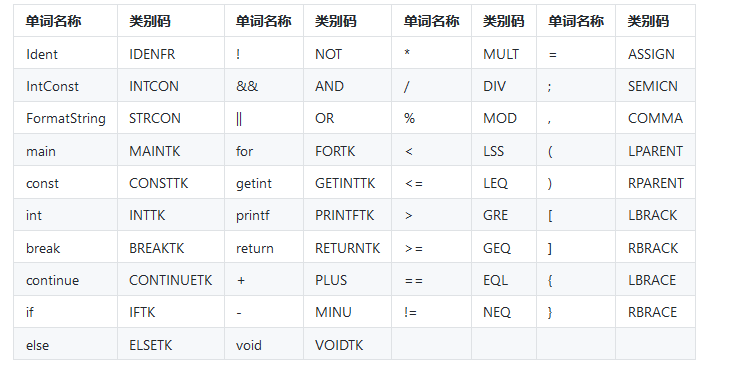

## 二. 词法解析器Lexer设计
词法解析器通过扫描输入的源程序字符串，将其分割成一个个单词，同时记录这些单词的类别信息，
主要用途在于耦合进后续的语法解析器，使得语法解析器在解析文法时词法解析器可以源源不断为其提供语法解析的最小单元，**单词**。

因此我们的词法解析主要功能有二：
1. 不影响其他的基础上消除掉单行注释与多行注释
2. 依次将每个单词及其相应信息打包取出，直至输入文件结束

我们定义Lexer类，内部属性与方法有：
1. input: 输入字符串
2. pos: 当前解析到的位置
3. curWordInfo: 记录当前读到的单词种类，单词值，行数等信息
4. next(): 读取下一个单词

本质上我们读取单词的过程等价于一台有限状态自动机，词法解析(next函数)的基本逻辑如下图所示(直接偷PPT的图力)：

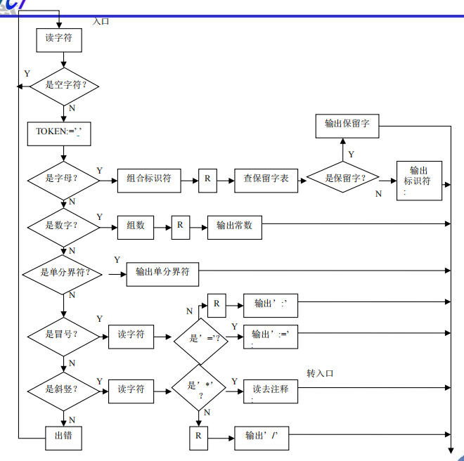
## 四. 预读策略
我们发现单词中有一些单词存在前缀重叠的情况，如'<'和'<='，对于这些前缀重叠的单词，从词法层面我们既可以认为这是一个单词，也同样可以认为是两个单词，因此在此处应进行语法层面的考量，我们单单读入一个符号是无法判断的，因此需要”偷看“下一个字符来判断是哪一种单词。

## 五. 词法解析器的Bug
1. 注释消除有误，打印字符串内存在"//..."时也会被当作注释消除，在消除注释时特判此种情况。

# 语法分析设计文档
## 一. SysY文法的终结符
* Ident
* Number
* FormatString(即使他有文法，仍将其看作终结符)
* 各种符号，关键字
## 二. SysY文法中有极多非终结符，将在下列出非终结符的FIRST以及是否有冲突情况，以便于解决后续问题
从简单至复杂分析，有助于分析复杂非终结符的FIRST
* <CompUnit\>: {}
* <LVal\>: {Ident}
* <PrimaryExp\>: {'(', Number, Ident}
* <UnaryOp\>: {'+', '-', '!'}
* <UnaryExp\>: {'(', Number, Ident, '+', '-', '!'}
* <MulExp\>: {'(', Number, Ident, '+', '-', '!'}
* <AddExp\>: {'(', Number, Ident, '+', '-', '!'}
* <ConstExp\> = {'(', Number, Ident, '+', '-', '!'} **特殊: Ident只能是常量**
* <Exp\>: {'(', Number, Ident, '+', '-', '!'}
* <ForStmt\>: {Ident}
* <FuncRParams\>: {'(', Number, Ident, '+', '-', '!'}
* <RelExp\>: {'(', Number, Ident, '+', '-', '!'}
* <EqExp\>: {'(', Number, Ident, '+', '-', '!'}
* <LAndExp\>: {'(', Number, Ident, '+', '-', '!'}
* <LOrExp\> = <Cond\>: {'(', Number, Ident, '+', '-', '!'}
* <Block\>: {'{'}
* <Stmt\>: {'if', 'for', 'break', 'continue', 'return', Ident, 'printf', '{', ';', '(', Number, '+', '-', '!} **存在冲突**
* <ConstDecl\>: {'const'}
* <ConstDef\>: {Ident}
* <ConstInitVal\>： {'(', Number, Ident, '+', '-', '!', '{'}
* <BType\>: {'int'} **可能要增加基本类型，因此不能将其视为终结符**
* <VarDecl\>: {'int'}
* <Decl\>: {'int', 'const'}
* <VarDef\>: {Ident} **有冲突**
* <Decl\>: {'const', 'int'}
* <Initial\>: {'(', Number, Ident, '+', '-', '!', '{'}
* <FuncType\>: {'void', 'int'}
* <FuncDef\>: {'void', 'int'}
* <MainFuncDef\>: {'int'}
* <FuncFParam\>: {'int'}
* <FuncFParams\>: {'int'}
* <BlockItem\>: {'const', 'int', 'if', 'for', 'break', 'continue', 'return', Ident, 'printf', '{', ';', '(', Number, '+', '-', '!}
* <CompUnit\>: {'int', 'const', 'void'} **有冲突**
## 三. 解决非终结符具有多产生式的问题
由上述分析可以得到总共有**四**处非终结符的FIRST存在冲突，接下来依次给出解决方案：
* **语句冲突**

       FrontEnd.NonTerminal.AllStmt → LVal '=' Exp ';'
        | [Exp] ';'
        | Block
        | 'if' '(' Cond ')' FrontEnd.NonTerminal.AllStmt [ 'else' FrontEnd.NonTerminal.AllStmt ]
        | 'for' '(' [ForStmt] ';' [Cond] ';' [ForStmt] ')' FrontEnd.NonTerminal.AllStmt
        | 'break' ';'
        | 'continue' ';'
        | 'return' [Exp] ';'
        | LVal '=' 'getint''('')'';'
        | 'printf''('FormatString{','Exp}')'';'

主要体现分支中两个LVal和Exp的FIRST集合存在交集{Ident}，若当前词法分析的单词为Ident，我们就无法判断该从哪一个分支进行解析。

这里给出教程中提到的方法：
考虑到Exp可以推理出LVal（Exp -> AddExp -> MulExp -> UnaryExp -> PrimaryExp -> LVal），因此我们可以用Exp的解析方法来解析LVal。如果当前单词为Ident，则
+ 1. 首先利用调用Exp的子程序来解析出语法成分Exp，判断下一个单词是';'还是'='，如果是';'，则按第三条产生式处理，完成Stmt解析，否则转第2步，从前两条产生式中选择一条解析
+ 2. 从Exp提取出LVal（该Exp一定由唯一的LVal组成），继续判断下一个单词是不是'getint'，如果是则按第二条产生式处理，否则按第一条产生式处理，完成Stmt解析

* **变量定义冲突**

    VarDef -> Ident { '[' FrontEnd.NonTerminal.ConstExp ']' }
     | Ident { '[' FrontEnd.NonTerminal.ConstExp ']' } '=' InitVal

两分支FIRST存在交集{Ident}，不难发现前半部分都相同，因此改写文法为：

    VarDef -> Ident { '[' ConstExp ']' } [ '=' InitVal ]

* **编译单元冲突**

    FrontEnd.NonTerminal.CompUnit -> { Decl } { FuncDef } MainFuncDef

虽然其中没有分支，但是也算是分支文法的改写形式，Decl，FuncDef，MainFuncDef的FIRST集存在交集{'int'}

解决方法，使用**未来探测法**
* 1.若当前读取到的词是int，则继续预读下一个单词，若是main，则回退并进入主函数解析；若都为变量名，则跳转第二步
* 2.再读取下一个单词，若是'('则跳转到函数定义解析，若为其他(具体来说包含'=', ';', '[')则跳转到变量声明解析中，别忘了此时要**回退两个单词**

* **一元表达式冲突**

    UnaryExp -> PrimaryExp | Ident '(' [FuncRParams] ')'

PrimaryExp和Ident的FIRST集合存在交集{Ident}，因此当首单词为Ident时仍使用未来探测法来预读下一个单词，若为'('则进入第二分支进行解析，反之回退，并进入第一分支进行解析。

## 四.左递归文法的改写
通过理论课程的学习，我们知道左递归文法是无法被自顶向下分析解析的，因为会无限递归，因此对于左递归文法需要改写。

左递归文法全部出现在各类表达式文法当中，统计并改写如下：
* 乘除模表达式

    MulExp -> UnaryExp { ('*' | '/' | '%') UnaryExp }

* 加减表达式

    AddExp -> FrontEnd.NonTerminal.MulExp { ('+' | '-') MulExp }

* 关系表达式

    RelExP -> AddExp { ('<' | '>' | '<=' | '>=') AddExp }

* 相等表达式

    EqExp -> RelExp { ('==' | '!=') RelExp }

* 逻辑与表达式

    LAndExp -> EqExp { '&&' EqExp }

* 逻辑或表达式

    LOrExp -> LAndExp { '||' LAndExp }

### **注意**：我们为了能正确分析而改写了文法，但是输出结果应与原文法保持相同，例如 2+3 ，使用改写后文法将+两边都看作MulExp，然而按照实际文法中，+左边为AddExp，+右边为MulExp。
### 解决方法：可以在每次解析('+' | '−') MulExp之前，先将之前已经解析出的若干个MulExp合成一个AddExp，输出一次<AddExp\>。
## 五.规定
为了确保语法分析和词法分析的配合，我们做出如下规定供参考：不行! 会产生输出顺序不一样的问题

* 一个子程序在调用其他子程序前，需要调用词法分析器来预读一个单词
* 一个子程序在退出时，需要调用词法分析器来预读一个单词

有了上述规定，就可以确保：

* 刚进入一个子程序时，词法分析器已经预读好了一个单词
* 从一个子程序返回时，词法分析器已经预读好了一个单词

再规定：
* 进入一个解析函数中，先创建该类实例，再按流程逐步填充对象，最后整体返回
* 一定不要为了麻烦而少写代码，想到多少就写上多少
* 先按要求每个非终结符和终结符都建立一个类 后再优化
## 六. 非终结符类的属性
在后续代码生成时再做细致考量，目前属性仅根据语法定义设置为相应的非终结符or终结符。

## 七. 文法分析中的Bug
1. 先新建Parser类导致Lexer提前预读，致使注释无法正常清除，应当先清注释再new Parser
2. 未考虑完全定义时Ident后面可跟着的终结符情况，少考虑了一种int i, j; (逗号情况)

# 错误处理作业设计文档
## 零.作业要求
设计并实现错误处理程序，能够诊断出题目要求的常见语法语义错误，并进行适当的局部化容错处理，输出程序中所有错误信息，包括类型与位置。

## 一.错误编码
本次作业只针对如下数条错误情况予以考虑。
* a 非法符号：在字符串中出现的非法符号
* b 名字重定义：变量名在当前作用域下的重复定义，内层覆盖外层定义是合法的，必须是同层作用域才出错
* c 未定义的名字：使用未定义的标识符
* d 函数参数个数不匹配：调用语句中传参个数与符号表中函数定义时参数个数不一致
* e 函数参数类型不匹配：同上，参数类型不匹配
* f 无返回值的函数存在不匹配的return语句：void函数中任意地方出现return \<Exp\>。
* g 有返回值的函数缺少return语句：只需要判断函数末尾有无return，报错行号为}所在行号
* h 改变常量的值：对const定义的常量进行修改
* i 缺少分号
* j 缺少右小括号
* k 缺少右中括号：以上三个报错行号为前一个非终结符所在行号
* l 输出语句格式字符与个数不匹配
* m 非循环块使用continue和break

上述错误可大致分为两种，**语法错误**和**语义错误**，语法错误包括缺少符号(i,j,k)与输出语句中存在非法字符(a)，这些错误不满足文法要求；其余皆是语义错误，这些错误满足文法，然而不满足SysY语义限制。

进一步分析，其中b,c,d,e,h五种错误需要用到**符号表**，其余错误无需符号表辅助，可以通过在语法分析器基础上增添功能找寻错误。

## 二.符号表的建立
无论错误处理是否需要，建立起符号表都是必须的，符号表中每一表项Symbol结构如下所示。

|  属性名   |       ID        | 名称  |                 类型                 |    是否常量     |       行号       | (函数符号的附表)函数返回参数类型 | 函数形参个数 |           函数形参类型列表           |
|:------:|:---------------:|:---:|:----------------------------------:|:-----------:|:--------------:|:-----------------:|:------:|:----------------------------:|
| **描述** | 自增ID，Symbol的唯一标识符  | 符号名 | 0->int,1->int[],2->int[][],3->func | 0->变量，1->常量 | 符号的行号，错误处理需要用到 | 0->int, 1->void| num | Array\<Integer ∈ {0, 1, 2}\> |

每一张符号表存储HashMap<String, Symbol>，设计成哈希表一方面是由于每一张符号表的符号名不会重复，另一方面提高用符号名查询到对应Symbol的效率。

### 1. 作用域
每一个作用域对应一张符号表，开始一个新的作用域有两种情况，程序开始时的全局作用域以及每个<Block>都会开启新的作用域，因此要在这两处位置新建符号表。特别注意的是，**函数定义时的形参应当放到紧接着函数主体开启的符号表当中**。

作用域存在**树状结构**关系，符号表同理，查找符号时应当从当前作用域的符号表向全局作用域的符号表由底至上的搜索，这便需要我们记录下符号表的父节点。

因此一张符号表的结构如下所示。

|属性|          ID           |父节点ID|        包含的所有符号         |
|:---:|:---------------------:|:---:|:----------------------:|
| **描述**| 自增ID，SymbolTable唯一标识符 | 父符号表ID|HashMap<String, Symbol> |

在语法解析器中我们存储HashMap<Integer(id),SymbolTable>，便于我们通过id快速查找到对应的符号表。

**eg: 准确来说符号表应当是拼起来的总表，这里称呼的一张符号表算是总表的一个个子表，不过能懂哥们的意思就可以了**

## 三.错误处理
建立起符号表后，便可进行符号表相关的错误处理。符号表在当前需要提供如下两个功能。
* 给定一标识符名，在当前符号表中查找是否出现过同名符号。
* 给定一标识符名，在树状符号表集合中由底至上查找是否出现过同名符号，直至全局作用域的符号表。

第一个功能适用于判断是否出现**标识符重定义**；
第二个功能适用于判断是否出现**标识符未定义**，然而查到距离当前层最近的符号后，并不能直接下出标识符已定义的结论，还需要比较查到的符号类型和解析当前语法下需要的标识符类型，才能下定结论。

进一步讲，LVal需要常变量类型，UnaryExp的函数调用分支需要函数类型。

        // 如下所示 符号表查到的是函数类型的fun，而我们需要的是变量类型的fun，此时会出现“名字未定义”的错误
        void fun() {
        }
        int main() {
            fun = 1;
            return 1;
        }

其他错误的判断逻辑不过多赘述。

## 四.错误处理Bug
* 当处理 [\<Exp\>]; 中分号漏写的情况时产生问题。

问题原因：由于Stmt在判断AssignStmt,InputStmt,ExpStmt时使用的预读法会读走一个Exp，接着判断下一个单词是否是';'来判断是属于哪类语句，然而若';'不存在，则判断会产生异常。
解决方法：将判断下一个字符是否为';'改为判断是否为'='即可，'='不会出现缺失的情况。

* \<UnaryExp\> -> Ident '(' {\<FuncRParams\>} ')' 缺少右小括号的错误处理，即缺失某些符号时会在语法解析时引起二义性。

        // 正常
        b = a() + 3;
        // 缺失'('
        b = a( + 3;

问题原因：之前只需预读两位后判断当前单词是否是')'即可判断是否存在实参，而存在缺失括号后，这个方法便不再适用

解决方法: 预读两位后判断当前单词是否是\<FuncRParams\>的FIRST集来判断是否存在实参。

前提假设: 由于\<FuncRParams\>的FIRST集包括 {+， -}，而\<UnaryExp\>的FOLLOW集中也包括 {+， -} ，一旦去掉右小括号后会产生歧义。前提假设不会出现这种情况，即出现{+， -}时将其看作解析FuncRParam处理，这也符合C语言编译器的行为。

* 主函数也要考虑无返回值的问题
* '%' ascii码为37；'\'ascii码92 但是当且仅当和\n一起出现才算做合法，语法定义问题，自己不细致。
* 实参形参类型匹配中，应考虑到当实参是函数调用存在无返回值的错误情况。

解决方法：遍历Exp树，将所有函数调用的函数名取出，查**符号表**依次判断其**返回类型**，若至少有一个void则需错误处理。

* printf语句中同时出现非法字符和参数数目不相同。

为减少字符串遍历次数，我在词法分析时便记录了"%d"的个数与是否存在非法字符，并将其打包进wordInfo的实体中value属性。
问题在于将两个信息合二为一，我们规定value记录"%d"的数量，若存在非法字符，将value取负再减一，如此语法分析器可通过value的正负及大小得到上述两种信息。

* 处理注释时要保留换行符，不然行数会被打乱!

## 五.错误处理部分总结与Bug

* **加入错误处理后语法解析思路需要改变**：语法解析不能再过度依赖可能被删减的单词{;, (, [}，需要另寻他路。

例如，在给\<Stmt\>分类时，赋值语句，表达式语句和输入语句需要预读判断，之前的思路是试探解析Exp后判断此时栈顶的单词是否为';'，若是，则判定为表达式语句，反之则在另外两种语句中继续判断。而现在面临';'可能缺失的问题，因此我们需要转换思路，输入语句和赋值语句在解析完Exp后下一个单词一定为'='，反之则为表达式语句，颠倒了判断思路后即可解决。总之即**不能依赖于可能丢失的单词作为解析后续文法的依据**。

* 未考虑到的错误情况仍存在很多，且该任务已经为我们做了很多简化，每多考虑一种错误情况难度便会更上升一截。
* 学会使用C语言编译器(gcc)与我们的编译器做对照，观察gcc在错误处理时的行为，包括报错位置以及报错类型，尤其是存在多个报错的争议部分(比如名字未定义和函数参数类型不匹配同时出现)，并尽可能使我们的错误处理逻辑与其保持一致。

# 中间代码LLVM生成文档
## 零. 任务目标
由建立好的语法树生成中间代码LLVM，不考虑复杂优化方法。

## 一. 前置准备
1. LLVM生成时将常量全部带入，在后续中我们了解到属于**常量折叠**优化。
2. 在编译开始前遍历字符串，清+-连着的长串符号，这样可以减少部分无意义的运算指令。
3. 将错误处理和中间代码生成解耦合，即默认输入代码不出错。
## 二. LLVM的原则(犯过的错)
1. 基本块进入之前一定要有跳转指令，即使是顺序跳转
2. 使用字符串标号，使用顺序数字标号会出现奇怪的问题
3. void最后必须有一条ret void语句
## 三. LLVM结构
LLVM生成采用**User,Value,Use**的架构，具体的继承关系如图。

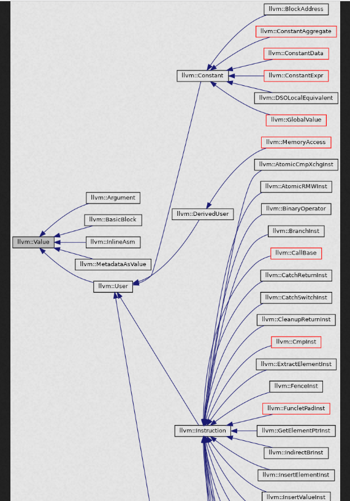

      %VirtualReg7 = add i32 %VirtualReg4, %VirtualReg6

**每一条LLVM语句都可以看作一个Value，Value是LLVM一切类的父类**，从直观来看，“=”左边的值便是一条语句的Value，又可以叫做综合属性或返回值，当然存在诸如Store这类没有Value指令，我们可以认为其Value为Null。

**User类继承Value类，而LLVMInstruction又都继承User类**，从直观来看，“=”右边用到的值，即一些操作数，便是一条语句的User，也可以称作继承属性或传入值。

**Use类记录了Value和User之间的联系，可以看作是def-use图中的一条边**，本架构中用列表替代了Use的作用，应当是等价的。

对于一条LLVMInstruction，它既作为一个User，又作为一个Value，作为User时，它记录了Value的列表，即记录了使用了哪些Value，又或者说使用了哪些语句的返回值；
作为Value时，它又记录了一个User的列表，即记录了这条语句被哪些语句作为操作数使用，通过这种引用关系，我们可以很容易的得到def-use链和use-def链等，为后续优化做好了基础。

在本次文档的最后，会给出一些对于优化的思考。
### 1. Value

      public class Value {
         public String value; // 虚拟变量名
         public int valueType; // 记录Value类型，具体如下
         public ArrayList<User> users; // 记录被哪些语句所使用
         public int firstSize; // 当为指针类型时，需要的额外维度参数
         public int secondSize;
      }
记录Value的返回值，规定如下
* -1 ---> 常规store, move （由于这俩指令无返回值）
* 0 ---> i32
* 1 ---> i32* // 一维指针
* 2 ---> [n x i32]*  // 一维数组的首地址或二维指针
* 3 ---> [m x [n x i32]]* // 二维数组的首地址
* 4 ---> i1
* 5 ---> func
* 6 ---> basicblock
* 7 ---> i32 ** // 一维指针的地址
* 8 ---> [n x i32]** // 二维指针的地址
* 9 ---> mem2reg新增 fakevalue // 记录后续mem2reg时需要的假标签，在重命名步骤时被替换为真Value
* 10 ---> 图着色优化新增，将溢出的变量store入内存所用的Value，仅作为标识 

**以上十一种类型可以表示该文法所有的返回值，在LLVM生成以及在后续生成中会发挥大作用**

### 2. User
      public class User extends Value {
         public ArrayList<Value> usedValues;
      }
记录了使用过的Value，从马后炮来看，优化似乎没有用到这一部分。

其余全部结构皆继承User与Value，以Value为最终父类，构建起了LLVM的中端架构。

## 四. 符号表
### 1. 是否需要重新建表
建树时已经生成过一份完整符号表，在每一个Block内记录符号表的id，由此生成LLVM时可实时获得当前层的符号表，复用旧符号表即可，无需再重建新的符号表。

使用全局符号表的问题：符号进入顺序无法确定，处理如下语句，第一个a会查到该层新定义的a，而不是全局的a。
解决方法：记录下符号表中每个符号的递增id，在定义语句出现时记录当前符号id，在非定义语句需要查表时，必须满足**查到的符号id小于等于当前符号id**，否则查到的符号在当前位置是**还没定义过**的，需要前往上层符号表继续查找。

    int a = 10;
    int main() {
        int b = a, a;
    }
### 2. 符号表的改动
要明确的是，符号表中记录的是符号定义，即是申请的一块地址。符号表中每一个表项新增记录Value的属性，记录**存储该符号的地址Value**，在后续使用到该符号时，首先从该地址中加载出相应的值，再进行相应操作。
是否可以存储对应地址的值，这样可以减少很多次地址的读取，不可以，因为对于数组sw无法确定具体的地址，这样无法及时取出，但是对于非数组，也许具有可行性。

## 五. 条件语句的生成
**and**优先级高于**or**
### 1. icmp
后条件可跟
1. 不等 ne;
2. 等于 eq;
3. 小于 slt;
4. 小于等于 sle;
5. 大于 sgt;
6. 大于等于 sge;

       %2 = icmp ne i32 0, 0
       br i1 %2, label %12, label %3 
### 2. Label位置
1. Stmt之前
2. elseStmt之前
3. if语句结束之后
4. 每个 && || （都对应一个Label）
### 3. 跳转语句位置
1. 每个&& || 末尾
2. Stmt末尾
3. elseStmt末尾(如果有)
### 4. 跳转语句跳到的位置
1. &&后
    1. 后一条 &&: 真 -> 后一条 && 的 Label; 假 -> 下一个 || 的Label / 若无 则 elseStmt 的Label
    2. 后一条 ||: 真 -> Stmt 的 Label; 假 -> 后一条 || 的Label
    3. 后一条 无: 真 -> Stmt 的 Label; 假 -> elseStmt 的Label
2. ||后
    1. 后一条 &&: 真 -> 后一条 && 的 Label; 假 -> 下一个 || 的Label
    2. 后一条 ||: 真 -> Stmt 的 Label; 假 -> 后一条 || 的Label
    3. 后一条 无: 真 -> Stmt 的 Label; 假 -> elseStmt 的Label（可见只应考虑后一条是属于&&还是||即可，上述两种情况可合并）
3. Stmt末尾 跳转到 if语句结束之后 的Label
4. elseStmt末尾 跳转到 if语句结束之后 的Label
### 5. 重填法
由于标签出现的位置，在跳转指令之后，无法第一时间填写标签名，因此需要在标签出现后重填跳转指令的标签。
生成跳转指令时使用如下假标签，采用上述规则生成:
1. !nextOrLabel
2. !nextAndLabel
3. !stmtLabel
4. !elseStmtLabel
5. !ifEndLabel

为每个条件语句开一个跳转指令列表，每当跳转指令出现时推入，每当真标签语句生成时，**立即**重填跳转指令列表中所有能匹配上的假标签，至于为何立即重填，因为nextOrLabel和nextAndLabel代表的位置会随着语句分析而变化。
### 6. 条件或循环语句嵌套问题
每个LoopStmt，CondStmt都需要一个待重填指令的列表，即将各个语句的跳转指令分离开来，重填时避免混淆。

## 六.循环语句的生成
### 1. 循环语句流程
1. 执行初始化表达式ForStmt1
2. 执行条件表达式Cond，如果为1执行循环体Stmt，否则结束循环执行BasicBlock
3. 执行完循环体Stmt后执行增量/减量表达式ForStmt2
4. 重复执行步骤2和步骤3
### 2. Label位置
1. 循环语句Stmt之前 stmtLabel
2. 循环结束之后的第一条语句 forEndLabel
3. 循环条件改变语句forStmt之前 forStmtLabel
   重填法设置假标签的思路同条件语句。
### 3. Break, Continue的处理
Break和Continue语法树节点生成时就要保存当前的LoopStmt节点引用信息，方便快速找到它是属于哪一个循环的。
Continue跳转到forStmtLabel; Break跳转到forEndLabel。

注意: **符号表中记录的符号对应的皆是一个地址Addr，使用符号时从符号表中得到地址，再从地址中取出值；而定义符号时，先申请一块地址，再将值存入对应地址中。**

## 七. 高维数组
### 1. GetElementPtr
**一维和二维数组首地址指针不会被存在内存中，但是它客观存在。**
该指令为地址转化函数，使用的Value(%1)和返回的Value(%2)都一定是指针类型，对本文法而言，只有 i32*, [n x i32]*, [m x [n x i32]]* 三种。

      %2 = getelementptr [2 x [3 x i32]], [2 x [3 x i32]]*%1, i32 0, i32 0, i32 0
对于该条语句，%1为基地址，[2 x [3 x i32]]*为该基地址指针的类型(若存到内存中均是4字节的地址，维度表明了该指针产生1单位偏移量时地址会随之偏移的多少)，[2 x [3 x i32]]为该基地址指针指向的值的类型，%2为目标地址，后面跟的每一个索引，第一个索引在原维度上偏移，自第二个起，先对目标地址降一维再偏移，具体不过多赘述。

### 2. 处理方式
高维数组传的是**地址**，不再是值。 第一个维度可以省略的原因是，需要后面的维度进行计算索引，而第一维不再需要，因为不需要关注数组越界问题。
1. 定义
    1. 申请内存
        * 一维数组：alloca [2 x i32]
        * 二维数组：alloca [3 x [2 x i32]]，开辟一块指定大小的空间, 返回值是数组的首地址
    2. 赋初值
       遍历数组，根据基地址计算出需要赋初值的地址，接着同0维数赋初值一样
2. 表达式计算中使用：由于表达式计算中不涉及指针运算，先根据基地址和偏移量读取出使用位置的目标地址，再取值即可。
3. 传参，分为实参传递和形参接收
   规定无论是否需要，在涉及高维数组计算时，都要使用getelementptr指令进行基地址到目标地址的转化。
    1. 作为实参传递，根据符号表中查到的符号类型(分为一维数组，二维数组，一维指针，二维指针)与目标形参参数的类型(数值，一维指针，二维指针)，所有情况进行枚举分析。其中一定会使用到GetElementPtr指令，这在后续生成Mips有所用处。
    2. 作为形参接收，函数的形参实际上也是数个定义语句，并将传过来的参数保存进定义的地址中即可。
## 八. I1到I32转化
处理条件语句时，涉及i1和i32之间的相互转化(在MIPS中并无这类问题)，具体来说
1. icmp语句的Value是i1类型，使用的两个操作数是i32类型。

        %2 = icmp ne i32 0, 0
2. br语句使用的比较01操作数是i1类型。

        br i1 %2, label %12, label %3
条件跳转指令依赖于EqExp，为简便，统一规定EqExp返回i1类型的Value，RelExp返回i32类型的Value，当涉及到链式计算时，应使用zext指令将i1转化为i32类型；使用 cmp ne 0 将所有非零的i32转化为i1 1;零的i32转化为i1 0。
## 九. 优化方向
生成LLVM后，并没有用到Value的User的列表，即并没有记录当前指令被哪些指令所使用，同时由于LLVM的特殊性，除了定义语句，其他值都是随用随从对应地址中取值，因此**非定义的每个Value当且仅当被后续的一条指令所使用**，记录下来并没有意义。

可以预见到如此做会产生极大量的内存读取指令，必然可以优化，根据def-use链的思想，在一个变量未赋新值前，都可以使用上一次赋值的虚拟变量，这样便省去了读取内存指令，然而这又涉及到基本块的关系以及分支间的选择(phi指令)，暂且留到优化文档中进行更深一步的探索。
## 十. 编译命令
* 链接两.ll文件，生成可执行文件 clang main.ll lib.ll -o out.exe
* 执行 out.exe
* 后进行输入

# 目标代码MIPS生成设计文档
## 零. 任务目标
由生成的中间代码LLVM转化为目标代码Mips，实现简单的寄存器分配，暂时不考虑后端优化。
## 一. 前置准备
### 1. Mips基本分区
#### data常量段
包含所有准备输出的字符串。
#### text代码段
包含全局变量，使用GP做偏移。
函数和主函数代码段，其中变量定义，入栈时使用FP做偏移。
### 2. 关键寄存器
1. $gp: 全局寄存器 记录全局变量
2. $sp: 栈顶寄存器
3. $fp: 栈帧寄存器，记录的是活动记录基地址 开局 li $fp, 0x10040000 设置栈帧寄存器
4. $t0~$t7，$s0~$s6: 待分配寄存器
5. $v0, $v1, $t8, $t9: 机动寄存器，用于倒手。
### 3. Mips指南
1. syscall的使用 $v0中存储指令代码
    1. syscall 1 - 打印整数：将整数参数存储在 $a0 寄存器中，然后使用 syscall 1 来打印这个整数
    2. syscall 4 - 打印字符串：将字符串的地址存储在 $a0 寄存器中，然后使用 syscall 4 来打印这个字符串。
    3. syscall 5 - 读取整数：将整数的地址存储在 $v0 寄存器中，然后使用 syscall 5 来从用户输入中读取整数
    4. syscall 10 - 终止程序
    5. syscall 11 - 打印字符：将字符的数值存入 $a0 寄存器中，然后使用syscall打印字符
2. li $x, 0x1: 将立即数赋值给指定寄存器
3. la $x, addr: 将地址赋值给指定寄存器，用于输出字符串
4. move $x1, $x2: 将$x2中的内容赋值给$x1
5. li $fp, 0x10040000 设置栈帧寄存器
6. j 直接跳转; jal 跳转到函数，将返回地址保存到$ra；jr $ra 连用，从返回地址返回；bne 不等于0时跳转；beq 等于0时跳转
   在传参时，前四个让a传，多出的部分用$fp
   $fp用来记录每个函数的栈帧，和常规不太一样，需要再想想sp,fp的配合使用
   $sp只用来记录$ra返回地址

## 二. LLVM到MIPS指令的转化
### Cmp和Br
1. Cmp 的各种比较符号置一 完全替换成 MIPS 的sgt,sge等指令即可
2. Br：跳转指令 直接跳转替换为j；br i1 label1 label2 可替换为 bne $x, $zero, label1 + beq $x, $zero, label2 两条语句
3. Call: jal

## 三. 符号表的重复使用
分为活动变量，用sp记录，和分配给定义变量的地址用fp记录
每个符号需要被标注上存的地址，继续用全局符号表即可，经过LLVM代码生成后，每个符号都带有%xx,@xx的identifier，不同函数间可能重复，因此仍然要每个函数只能看到自己的符号表

每个函数对应一张符号表，父id将重新记录

好像不能重复使用了，因为虚拟寄存器与符号表记录的信息相比多了许多中间变量，而这些中间变量也需要分配寄存器，则我们需要**在生成中间代码时重新构造一张符号表!!!**

## 四. MIPS符号表内容
不能完全复用错误处理时的符号表，因为虚拟寄存器与符号表记录的信息相比多了许多中间变量，而这些中间变量也需要被记录，则有需要**在生成中间代码时重新构造一张符号表**，而构建起两张符号表的联系是必要的。

中间代码的每个虚拟变量由Value记录，因此我们直接使用Value作为中间代码符号表的单元，在value上额外记录一些属性即可。

新增属性:
1. offset; // 对于基地址，是基于Fp或Gp的偏移
2. isGp; // 标记全局Alloc的属性
3. isFp; // 标记局部Alloc的属性
4. isInReg; // 该Value是否在寄存器内

## 五. 函数调用
分为调用方，和被调用方，调用函数时，此时已经使用过的寄存器要压入栈，返回时重新填入。

### 1. 调用方调用函数流程
1. 将前四个参数放入A中
2. 将当前FP，RA，当前函数未释放的寄存器保存到SP中 即保存上下文现场
3. 将FP增长至被调用函数的栈帧处，根据当前函数记录的
4. 将剩余参数存入FP首地址的位置
5. 执行跳转 jal xxx
6. 返回后首先将FP,RA从SP中取回 SP = SP + 8
7. 将返回值转移到其他寄存器，继续运行

### 2. 被调用方处理
函数开始时需要将参数全部装入当前函数的栈帧中，计算时可能会出现寄存器不够的情况，若传递的参数大于当前寄存器可用的数量，要压栈。

    mipsInstructions.add(new Sw(V0, fpOffset, FP));
    irInstruction.offset = fpOffset;
    fpOffset += 4;

## 六. 对于机动寄存器的考量
前提说明: 以下部分记述较乱。

理性分析：V1可自由随意使用，作为地址机动寄存器。
A0~A3，传参时使用后立即被释放，考虑到被调用者接收时，直接转移寄存器，原子操作，不会重新对A赋值，而参数传递时，多于四个时有可能需要用到机动寄存器，可此时A0~A3已经有值，A0~A3不适合作为立即数机动寄存器。
V0用来存放返回值，同样是原子操作，函数末尾存储，调用者承接；还可以用作syscall，同理函数调用，V0立刻被释放，因此V0可以用作立即数机动寄存器
A0传参和syscall应当不会冲突，因为syscall就是调用函数。
V0在SYSCALL时会被使用，可能会被顶替掉原先的值，用于装填立即数，使用后立即释放(疑似可以，但是T8,T9一对更好)，A0同理，在syscall时可能会被使用，因此V0,A0不乱使用了
计算地址的机动寄存器使用V1，V1可能会保留一段时间后再使用，这个时候不可以使用V1。

### 结论
在参数传递时，若多于四个参数，此时A0~A3也无法作为中转寄存器，那我们规定**V0,T8,T9**作为立即数转移的机动寄存器，也作为压栈的临时寄存器，他们的共同特点就是使用后立即释放；**V1**地址机动寄存器。

由于地址每次都重新计算，因此V1一个就够，只要规定不随意使用V1。

人为规定，立即数只用V0，装，新地址只用V1装，这样不会和其他任何产生冲突。

释放寄存器时，多释放不如少释放，比如一个Value可能已经被T1存放，也可能时一个常数，在使用时被机动寄存器V0存放，此时无论是谁存放，使用完皆释放即可。

## 七. 相对与绝对地址
### 1. 对于相对地址和绝对地址的区分
我们尝试找到一种寻址比较易于理解的方法。
Value具有几个关键属性
1. isFp，isGp: 这两个标识**仅**出现在Alloc的Value中，根据全局or局部设置为True，目的是配合offset设置定义的变量地址，对于数组而言即首地址(fp/gp + offset)。
2. isInReg，reg: 标识该Value的值是否在寄存器中，若在，则位于reg号寄存器。
3. offset: 偏移量，若isFp/isGp为True，表示定义的变量的相对偏移量；若为false，意为由于寄存器不足，将临时变量存入内存中，保存的地址相对于当前栈帧FP的偏移量。
   通过上述属性可完备的得到Value的值

换句话说，offset在这两种情况表达的含义不同，由于寄存器不足而入栈的Value的offset，指的是**Value的值存入的那块地址相对于栈帧的偏移**；而alloc的Value本身就是地址，offset是Value值的偏移。
### 2. 取值方法
首先明确，我们想要得到一个Value的**值**，一共有两种方法
1. 从内存中取，获得所在内存的地址又分为两种方法
    1. GP + offset offset是相对于全局基地址的偏移
    2. FP + offset offset是相对于当前栈帧基地址的偏移
2. 从寄存器中取，此时寄存器中保存着Value的值

针对store,load,getelementptr这三条指令的转化是重点，我们默认地址都指绝对地址，只是存储方式有区别。
当**Value存的值是一个地址**时，即上述三条指令会涉及，这个地址(Value值)可能有两种情况。
1. 该地址是alloc的Value，根据上述区别，这时地址就是Value中FP/GP + offset 。
2. 该地址是经过elementptr转化过的目标地址Value。这时通过上述的取值方法可得到地址的值。一旦寄存器或内存中保存了地址，则一定为绝对地址。
3. 区别在于，第一种情况只需要Add($a, FP, offset)，而第二种若Value在内存中则需要Lw($a, offset, FP)，a为绝对地址。
   当涉及到传指针，即传地址时，传的应当是绝对地址(若是相对地址，则由于不同函数的FP不同，无法得到绝对地址)，而传指针时必然会涉及到一步getelementptr，因此我们规定getelementptr的Value一律保存绝对地址。

### 3. 区分相对与绝对的必要性
相对只是绝对的另一种描述方式，本质上寻址都是基于绝对寻址。

## 八. 优化方法
由于LLVM的临时变量(除去定义)用完即释放，操作数的寄存器一旦被用了一次即可释放，因此寄存器会比较够用，也会不易产生入栈读写内存的开销。然而这些应当是由于LLVM优化不够导致的，
正如上一篇LLVM生成文档所言，一旦一个临时变量可以被多次使用，那么我们便不能轻易释放寄存器(但凡后面还会用到该Value)，寄存器之间的冲突会加剧，调度与分配会更为复杂，这些在优化LLVM后应当着手考虑。
1. 图着色寄存器分配
2. 乘除法优化，可以优先实现
3. 基本块优化与窥孔优化等

# LLVM优化文档
## 零. 写在最前面
本文档是随敲随写的，最后整理时较为匆忙，优化着实是太过折磨，因此若文笔过于晦涩且不够周到，还望海涵！

## 一. mem2reg

#### 0. 写在前面
**在sysY中定义的变量称作原始变量，而在LLVM中的一个个变量我会称作虚拟变量(后续很有可能会统称为变量...但实际不一样)，定义和赋值的概念不再区分**。

本优化不考虑全局变量和数组，仅针对单值int和指针(本质上是一字节的值)进行优化。我们最初的LLVM已经是SSA单赋值形式，而mem2reg这步，对于用LLVM为中间代码的我来说，应当是对原先的LLVM打散再重构的过程。

首先要明确，最初的LLVM是单赋值且单使用(除去Alloc指令)，一个原始变量被拆成过多的虚拟变量，因为我们使用的每一个虚拟变量都是从活动记录中LOAD取出，即一个虚拟变量被单赋值的同时也仅被使用了一次。我们现在要依据每个原始变量的def-use链(一个变量的生命周期，从被定义，到被使用，到再次被定义结束)改造成单赋值多使用的形式(同样是将原始变量拆成多个虚拟变量，但是仅在定义时拆)，通过这第一步，我们便可以消去一部分的访存指令。
但由此会引发一个重大的问题，借用教程的图图。

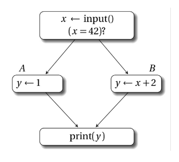

在分支汇总处，一个原始变量的取值会取决于数据从哪条分支上流入，上图AB块中的两个y我们称作y1和y2，print块中的y并非定义而是使用，那么它的取值便成了未知数，我们用 y3 = phi [A, y1], [B, y2] 这条指令对y进行一次定义，y3成为此时y的唯一取值。

接下来的工作便是以**基本块**为最小单位找到**在哪里插入phi指令**，进而找到**哪些变量该使用phi指令的结果**。最后结果是**使得每一个原始变量在指令的任何地点有唯一的虚拟变量取值**。
#### 1. 计算基本块前驱与后继结点
依据基本块跳转指令来记录每一个基本块的前驱和后继基本块们就可以，记录基本块前驱与后继。进入节点无前驱，退出节点(最后一条为return语句的基本块)无后继。
#### 2. 计算被支配节点（支配集合）
首先定义如下:
1. 支配（dominate）：如果CFG中从起始节点到基本块y的所有路径都经过了基本块x，我们说x支配y，按照这个定义，每一个节点都支配自己。

2. 严格支配(strict dominate)：如果x支配y，且x不等于y，那么x严格支配y。

3. 直接支配者（immediate dominator, idom）：严格支配n，且不严格支配任何严格支配 n 的节点的节点(直观理解就是所有严格支配n的节点中离n最近的那一个)，我们称其为n的直接支配者。

接下来我们计算每个节点被哪些节点支配。
**Lengauer-Tarjan**算法较为复杂，我们采用**迭代数据流算法**，流程如下:
1. 将起始节点设为r，初始化为仅被自己支配
2. 其余起始支配节点初始化皆为被全部节点支配。每个基本块保存一个HashMap<BasicBlock, Boolean>用作记录被支配关系。
3. 每次迭代取前驱结点的被支配集合的交集与自身的并，直至集合无变化，此时得到各节点支配关系，注意这不是支配树。

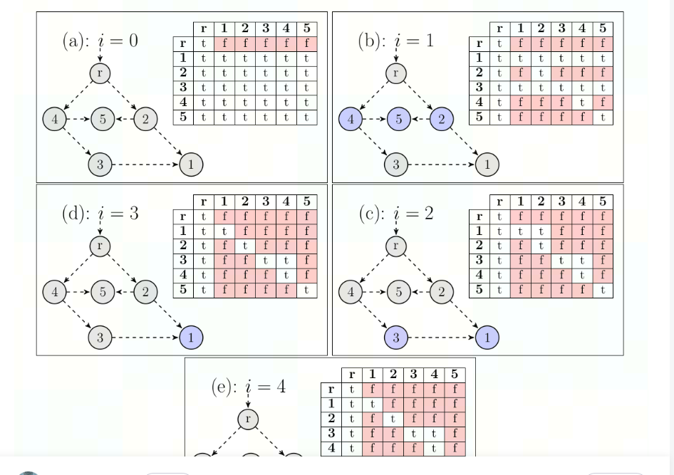

所谓a严格支配b，对符号x而言，即b中的第一次定义x之前的值完全由a的最后一次定义来决定，不存在任何歧义。因此显然自己无法严格支配自己。

#### 3. 计算直接支配者
根据定义(严格支配n，且不严格支配任何严格支配 n 的节点的节点)计算，我们已经求得支配n结点的全部节点，只需要遍历一遍即可找到藏在其中的直接支配节点。

每个节点的直接支配者是其父节点，根据此关系我们构造出了**支配树**。

#### 4. 计算支配边界
首先明确为何计算支配边界，一个节点的支配边界代表着支配范围的边界，在该节点对变量的定义会在边界处会产生歧义(即这个定义只是多个取值的可能一种取值)，因此我们需要计算支配边界来找到插phi的位置。
我们已经求得每个节点的直接支配者，采用如图算法。

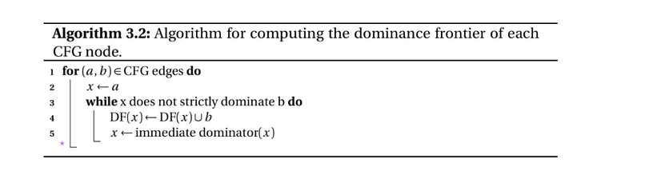

简单解释该算法：我们遍历有向图中每一条边(a指向b)，从两个节点最近的位置，即一条边开始，逐渐沿a的直接支配者往上，直至a能够直接支配b，在此之前的遍历到的所有节点，其支配边界都该包含b。

注意，**自己可以是自己的支配边界**，考虑 0 --> 1 --> 2 --> 1，即出现回边时，自己基本块的定义也可能不由自己决定。
#### 5. 插入phi节点
核心算法如图：我们得到了支配边界后，此时以原始变量作为最小单位，记录下原始变量在哪些基本块中被定义过(此时需要与符号表配合，见改造符号表一节)
，进而找到基本块集合的支配边界，由于我们要在支配边界上插入定义的phi指令，支配边界也便成了定义的基本块，因此需要将支配边界也纳入基本块集合中，同时记录支配边界们，直至找到**闭包**，定义基本块集合不再变化。
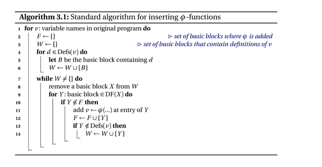

这时我们求得了待插phi的支配边界集合，但是要明确的是，**经过上述算法得到的是可能插入phi的位置，并非一定插入**，由于我们的文法支持各处定义，在一个基本块插入phi值时可能出现该变量未被定义的情况，这是不应该的，因此在得到插入phi的基本块集合后，需再次判断该变量在该基本块是否存在定义。**这一条限制是我们SysY文法的限制，而非一般算法中给出**。

在重命名前，即使Phi指令未被填全，但是该指令的Value(即该变量在基本块中的新定义)已然存在。新增的Phi填充完毕，意味着此时变量定义已然完备，一个变量在任何位置都具备了变量唯一性，重命名只需要做两件事，计算Phi指令流入的Value，为一开始找不到定义的假标签找到属于它的Value。

试做证明：**插入phi后，若在当前基本块x仍找不到定义，则其真正的定义一定在直接支配者y中**。
当前基本块找不到定义，说明当前基本块未定义，且未插phi，说明该基本块未被当作支配边界，则该基本块定义唯一来自其直接支配者y。
#### 6. 重命名phi
我们由第三步可得知节点的父节点，根据父节点推出每个节点的子节点，构建支配树，为接下来DFS做准备。

我们需要DFS支配树，基本块a是基本块b的直接支配者并不意味着基本块b中的变量由a中的变量直接决定，而是由a中的变量和将b作为支配边界的基本块们中的变量共同决定。

重命名需要三步，第零步需要判断当前插入的phi的合理性(即是否沿每条前驱块都能找到对应定义)，第一步**为phi指令的每一条数据流找到归属**，第二步**重命名该基本块内在生成phi之前无法得到准确赋值的被使用的变量**(一开始以假标签的形式填充)。

第一步：为phi值添加基本块流，需要保证其每一个前驱基本块都要为PHI提供一条数据流，对于每一前驱块，沿其直接支配者找到最近的该原始变量定义，将其填入Phi指令中。这一步的正确性**基于DFS支配树**，保证遍历到一节点时，其直接支配者的phi指令都已装配完毕。
第二步：重命名假标签同理，首先判断在Phi指令的插入后能否在当前基本块找到定义，若找到则重命名假标签为该phi值，若找不到，则沿其直接支配者找到最近的定义即可。上述寻找过程一定都能找到，因为在插入PHI以后，已经**确保了每个原始变量在每一时刻的虚拟变量的唯一性**。

         int main(){
             int a1 = 1;
             if (a1 > 3) {
                a1 = a1 + 3;
             }
             return 0;
         }
考虑如上情况a1应该被唯一确定，if内a1并非处在a1的决策边界处，dfs支配树。

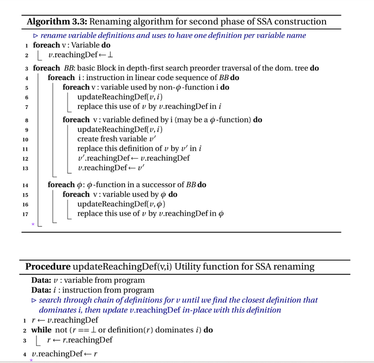

给出官方的算法，由于本人到这一步看不太明白，于是上文均是自创，完备性有待商榷。
#### 7. 附：改造符号表
尝试过多种方法，考虑过新建一张LLVM专用的符号表，思来想去觉得麻烦，于是便复用Value构建了一张符号表，每个Value记录其原始变量(Symbol)，再通过一些数据结构记录每个基本块内存在的Value，Value和Symbol应当是多对一的关系。

## 二. 基本块合并
这一步应用在CFG之后，计算支配关系之前，因为涉及到对基本块的删除，主要工作有二。

1. 将非连通基本块删除
2. 将相邻基本块(该基本块有且只有一个前驱且该前驱有且只有当前基本块一个后继)和二为一，指令相融合

由于我们在上文已把基本块的关系构建完毕，接下来处理较为容易。

### 注意
#### 1. 基本块间的关系是一个双向链表，在合并以及删除时应注意前驱节点和后继节点的修正。
具体来说，设被合并删除的基本块为a，合并的基本块为b，则a不再是b唯一的后继节点，而a的后继节点成为b新的后继节点；a的后继节点们的前驱节点也不再是a，而替换为b!
#### 2. 不只是指令的copy，还涉及到变量定义位置的改变。
合并基本块会导致定义位置紊乱，可能无法沿支配树找到最近Value，需要额外的操作。由于满足一对一关系，合并的块一定是被合并的块的直接支配者!
1. 我们可以遍历被合并的块全部指令，用合并块的定义表进行匹配，将能匹配上的假标签替换为合并的块的定义Value，由于存在先后关系，定义表中保存的变量定义是最后一次定义，而被合并块存在的假标签一定是在该基本块第一次定义之前出现的，因此匹配正确性得到保证。
2. 将被合并块的定义符号表(IrSymbolTable)转移到合并块的定义符号表，若合并块中存在该变量定义，则替换(因为被合并的在合并的之后); 若不存在，则加入。

## 三. 死代码删除
### 1. 概念：
程序包含的一些代码可能并不会被运行或者不会对结果产生影响，那么我们称这种代码为死代码。我们将不会被运行到的称为不可达代码，将不会对结果产生影响的代码成为无用代码。删除无用或不可达代码可以缩减IR代码，可使程序更小、编译更快、执行也更快。
### 2. 死函数删除
构造函数调用链，删除没有使用过的函数。不过这一步只能减少生成的代码，并不会减少执行的cycle。使用BFS计算出有价值函数的闭包，其余删除。
### 3. 死代码删除
我们目前认为的有价值指令有：br, ret, call, store（有待商榷，需要进一步做内存分析，全局变量的store可以无脑加，局部变量的store取决于后续有无使用它的，需要涉及到公众子表达式删除等问题），其中store会在后文做一些微不足道的优化。

采用逆推的形式，将所有有价值指令标记，再将有价值指令的操作数标记....大体思路同死函数删除，使用BFS计算出有价值指令闭包，其余指令删除。

## 四. 局部公共子表达式删除
局部子表达式删除的正确性建立在基本块内指令的顺序执行。若是在全局范围内优化，则需要考量基本块执行顺序的问题，出现哈希冲突时并不代表其中存在可以优化的项，例如在两个分支中出现了

    分支1：c1 = a + b, d1 = c1 + a；
    分支2：c2 = a + b, d2 = c2 + a；

此时我们不能将c2优化为c1，因为c1在这条分支中不会被计算。由于时间原因，我们只针对部分指令进行局部子表达式删除，包含add,sub,mul,div,getelementptr,cmp。该优化以每条指令为最小单元，站在基本块视角进行，步骤如下：
1. 对于每个BasicBlock初始化一个哈希表

2. 对每条指令，获取它的操作数和操作符，根据操作数和操作符计算哈希值，需要特别考虑add，mul，cmp三类指令，他们存在着多种等价形式，add和mul将操作数颠倒同样等价，而对cmp而言，例如a>b和b<a等价...

3. 扫描基本块内全部指令，计算哈希值，如果哈希表中已经存在该值，那么我们直接将BasicBlock里后续用到该value的地方全部替换为哈希表内存的value，否则将哈希值及对应的value存入哈希表

## 五. 常量折叠与传播
1. 提前计算好操作数为常数的表达式，针对add,sub,mul,div,cmp等进行了常量折叠，缩减计算指令。
2. 只进行了较为简单的复杂折叠，诸如 0 * a, 1 * a, 0 + a, a - 0, 0 / a 等相邻情况的简单优化。

## 六. 优化Store指令
进行内存分析，删除一些无用的store指令：例如有时我们会在load之前多次对同一个地址进行store，那么显然只有最后一个store是有效的，前面的store指令可删除，删除后可能会暴露新的优化空间，再次进行死代码删除。

## 七. 全局指令移动（超简化版）
指令移动时有如下要求：
1. 操作数在循环中不变，为定值
2. 移动不会产生**副作用**，比如涉及存入内存等指令，若提出循环外，则可能没进循环，却由于外提而执行这条指令导致影响下文，这种即是产生了副作用。
3. 为变量赋值也是一种疑似会产生副作用的操作，经过了死代码删除后，留下的被赋值的变量一定会在下文中被用到，外提还需要对phi指令做一些处理，比如循环外对i赋值，循环内也对i赋值(但满足操作数不变)，此时在循环结束后使用i值，正常应该是使用phi将两个数据流汇总，而外提后变不太对劲了....

我们首先通过深度优先遍历CFG找回边得到**处于循环内的基本块**，我们只针对循环内的基本块中某些语句做出前提，一是由于循环外指令再怎么前提也不会产生正面优化，二是指令前提也会产生活跃变量范围增大，溢出节点增多等副作用，需要权衡考虑。

为简单起见，只将偏移量为常数的gpr指令尝试前移至基地址的定义位置之后，若使用全局变量基地址则前移至入口基本块处，如此可避免多次重复计算访存地址。

正确性：一是gpr内操作数不变，二是gpr得到的结果是唯一的(Gpr的结果并非是原始变量，而是临时变量，不会对phi流产生影响)，一定不会存在副作用。

经实际检验，在第七个竞速测试点得到了大量优化。

# MIPS优化文档
## 零. 写在最前面
优化并不过多区分究竟是**中端**还是**后端**。

## 一. 后端消PHI
这一步说是优化，然而是LLVM经历过mem2reg优化后不得不做的一步。

消PHI即将PHI指令消去，换句话说，PHI指令的Value值应该保留，但后面的数据流应当通过Move指令消去。LLVM是有规则的，对于基本块B，若其有多个前驱的基本块B1,B2...且B中存在phi指令，我们可以在B1->B之间添加新的基本块B' ，新添加的基本块内只有一种指令，即move指令。

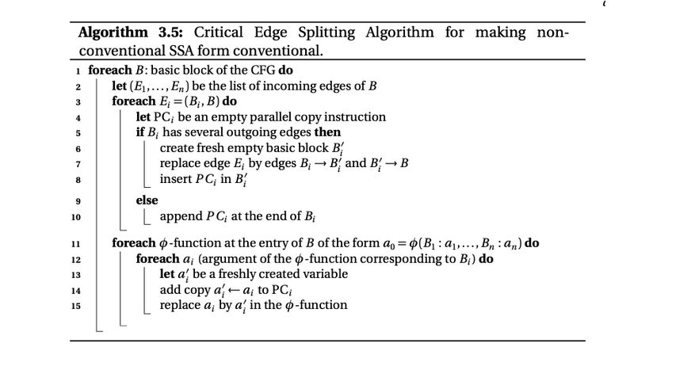

参照教程内思路，首先遍历全部基本块，找到入口存在phi指令基本块B(存在Phi指令意味着其一定有两个及以上前驱节点)，遍历其每个前驱节点Bi，若其拥有超过一个后继节点，则(Bi, B)称作一对关键边，在这之间创建一新基本块B',若Bi仅B一个后继节点，则后续在Bi结尾进行。

创建好基本块后，遍历B中所有PHI指令，对于 %x = phi((%b1 %v1), (...))，找到其前驱基本块b1对应的Move指令插入位置(新基本块or末尾)，插入指令 %x = move %v1，对于phi内其他数据流同样操作即可。

**需要特别说明的是：move是自己定义的假指令，对标mips里的move，其中保存两个Value记为target与source。**
如此我们通过加入大量move指令，完成了对LLVM的消Phi工作，在后续我们会尝试将move合并以缩减多余的move指令。

## 二. 图着色寄存器分配（核心）
mips优化中最核心的一步，经历消phi后，我们便可以着手生成mips代码。生成时进行图着色寄存器分配优化。

在之前的阶段当中我们都假定了有无限个寄存器作为虚拟变量，而实际上mips后端的寄存器有限，经过大量摸索后寄存器分配如下：
zero, at不参与分配；v0, v1用作机动寄存器(即使用后立即释放，不会引起任何冲突)，用于承接立即数与在超过两个操作数的指令中进行中间计算，同时v1还被设置用来存放图着色后溢出的节点，并立即存入内存中，这两个寄存器不参与分配；
sp,fp,ra,gp寄存器用于维护堆栈，全局变量，返回地址等，不可分配；a0~a3用作函数传前四个参数，不可分配(这四个寄存器有过考量，最终实践证明传参时需要用来中间过渡的寄存器，否则由于传参寄存器冲突导致访存开销过大)，不参与分配；其余全部共20个寄存器参与图着色寄存器分配。

### 1. 计算活跃变量
应用在课内学过的计算活跃变量的方法，我们以基本块为单位计算出每个基本块内全部指令in和out集。计算方法为一个基本块中由下至上由out倒推in，而基本块内最后一条指令的out集由其后继节点们第一条指令的in集的并集决定，如此迭代计算，直至每条指令的in和out集合不再变化。为减少迭代次数，可以考虑从出口节点开始遍历。如此我们计算出了多个活跃变量集合，也即是**变量冲突的多个时刻**。

具体而言针对每一条指令，in集等于out集加上该指令的操作数节点，再减去该指令节点，如下图算法所示：

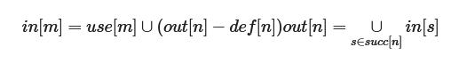

### 2. 构造冲突图Build
接下来开始图着色寄存器分配，整体算法如图所示：

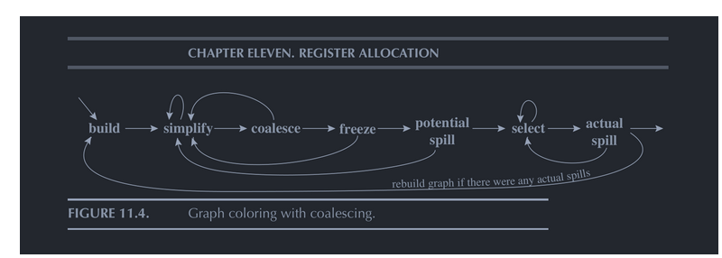

一个活跃变量集合里包含的元素两两冲突，彼此间都会形成一条无向边，我们在Value类内记录每个节点的邻接矩阵，遍历所有的活跃变量集合，得到冲突图，同时需要记录下move指令的两个节点，在后续可尝试合并。

冲突图代表着节点之间的冲突关系，存在边的两节点无法共用同一寄存器，我们进行启发式的图着色算法来为每个节点分配寄存器，最终目的为**在生成mips之前，每个虚拟变量被分配到了有且仅有一个唯一的寄存器**。

### 3. 简化Simplify
我们删除冲突图中度数小于K(20)的点，简化冲突图，将其入栈，产生更多的图着色机会，因简化步骤而入栈的节点**一定可以分配到寄存器**。
### 4. 合并Coalesce
move指令的两端节点本质相同，可进行保守式的合并，若合并后的度数总和小于K，则进行合并, 即二节点共用同一寄存器，将被合并的点彻底移除冲突图(需要记录下合并的点，为后续分配寄存器时能够得到合并点分配的寄存器)，同时注意维护现有图的邻接边关系；若合并后总度数大于K，则我们不进行合并，因为合并后可能会产生新的溢出节点，得不偿失。
### 5. 冻结Freeze
反复执行简化和合并的步骤，直至图中节点无法改变。
### 6. 溢出Spill
无法合并与简化时，将度数大于等于K的结点标注为不可分配寄存器，然后从冲突图中去除，将其入栈，因溢出步骤而入栈的节点**不一定能分配到寄存器**。溢出节点后简化了冲突图，会暴露出更多的合并和简化机会，如此反复，直至冲突图为空。
### 7. 选择Select
当冲突图为空时，开始从栈中挨个取结点，重新生成冲突图，为在简化时入栈的结点分配寄存器，将溢出时入栈的结点置入不可分配的集合。

最后尝试将不可分配寄存器集合的结点取出尝试为其分配寄存器(由于move等原因可能存在为其分配寄存器的可能)，若当真无法分配，则进行标记，将其转化为活跃范围较小的变量，并进行重新开始。
### 8. 重新开始Restart
如果无法进行着色的集合不为空，那么则需要改写程序，为这些变量在内存当中分配空间，并且在每次使用需要将其从内存当中取出。

这一步骤是最关键的一步，也是笔者改造最多的一步，关键在于如何理解教程中这段话：

*每次修改需要存进内存当中，这种情况下，溢出的临时变量会转变为几个活跃范围很小的新的临时变量，这个时候需要重新进行活跃分析、寄存器分配，直到没有溢出和简化为止（通常只需要迭代一两次）。*

冲突图中的节点有两种可能，一种是指令节点，另一种是函数的形参节点，假设某节点是溢出的节点，意味着**该节点应当在出现后立刻存入内存中，将其从活跃变量流中杀死，而使用到该变量节点时从对应地址中取出，再使用**。

出现：若节点是函数形参，则在函数最开始便已经出现，因此也在函数最开始添加指令，若为前四个参数则将对应的A寄存器存入内存，若为后续形参，则我们会在调用函数时处理将形参存入内存的过程，而并非在函数头执行；
若节点是指令节点，则在其被赋值的时刻出现，我们需要在下一条紧接Store指令，将其存入内存当中。

而为溢出节点分配寄存器本人采取了两种方式
1. 对溢出节点作标记后**重新开始**：该节点被使用时不再纳入活跃变量集合中，而与之绑定的store指令的操作数(也就是该溢出节点)仍需要纳入活跃变量集合，此时我们将**该溢出节点活跃范围缩小**，进而重新进行图着色分配，直至再无溢出节点。
2. 将溢出节点寄存器设置为机动寄存器V1：由于溢出节点在store后寄存器会立刻释放，不如使用机动寄存器进行转存，如此确保一趟图着色便可分配完毕，避免了重新开始的步骤，最后采用第二种方法，正确性无误。

以下是coding时一些随笔:
1. 从哪取：偏移量如何设置，偏移量来自两个地方，一个是数组的声明，一个是我们放不下的虚拟变量，先装我们的虚拟变量，翻译mips时实时填入二维数组。
2. 全局变量该如何记录，需不需要应急寄存器，全局变量符号出现在Load(无需缓冲)和GTR处(涉及计算，需要缓冲)，使用V1作为缓冲即可。
3. 最后每一个变量都会被分配一个绝对不会产生冲突的寄存器，生成Mips时直接对照寄存器无脑灌入即可。
4. 问题：即使有限次迭代可以保证分配好寄存器，但仍然存在死循环的可能性，当一个变量V无法分配寄存器，而将其转换在前面load出来时，由于load也需要一个寄存器承接，因此即使V不作为活跃变量在寄存器内流向更前面的定义处，而在当前处(load的out)处仍存在冲突的可能性，这时需要**重新开始**。

### 9. 经过图着色寄存器分配后的结果
每一条指令Value(或称为结果Value)都唯一确定分配好了一个寄存器，而使用的Value除常数外有两种情况。

1. 同样在寄存器中
2. 由于寄存器冲突而存在内存中，此时备注好了相对于FP的偏移，使用机动寄存器取出即可

接下来按照指令类型翻译为mips即可，相较于优化前，这一步是轻松许多的。

### 10. 生成mips
整体较为ez，有两个重点：
1. 对地址的处理：我们令alloc指令的结果为**数组的绝对基地址(fp + offset)**，getelementptr指令结果为**绝对基地址+偏移量**，同样为绝对地址，而对于溢出节点的使用采用当前fp的相对地址寻值，秉持上述原则，在处理地址问题便没有歧义了。
2. 对函数传参的处理：由于图着色后，形参和实参都分配好了寄存器，无可避免的会出现传递的当前形参的寄存器后续的实参还要用到，此时无法直接move的情况，此时需要一些算法来规避影响，最为简单的方法是用一块内存空间作为缓冲，实参先存入内存中，形参再从内存中调取。然而这会产生大量存取内存指令，因此这也是为何要令A0~A3作为传参缓冲寄存器的理由。

## 三. 乘除法优化
### 1. 乘法优化
特判乘数是否为2的倍数，若是2的倍数可改为左移指令。
### 2. 除法优化

除法优化即将除法改造为乘法和右移指令。

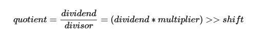

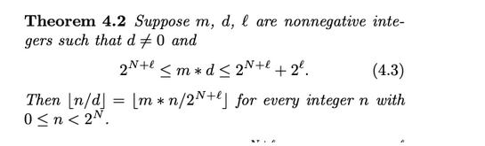

上述公式需要满足：
1. 被除数为正数
2. 除数为常数且为正数

根据不等式计算出乘数m和右移量l，由于我们需要保证被除数为正数且生成指令时无从得知被除数的正负，于是尝试人为构造了if语句并创建了两个新基本块用于被除数正数和负数的情况。
### 3. 取模优化
使用恒等式将取模转化为乘除操作即可(a % b = a - a / b * a)。

### 四. 优化产生的Bug
1. 第五个点wrong answer： 将gp设置为0x10000000即可，错误原因可能是全局变量爆了data段
2. 第六个点做了辣么多的优化，仅优化掉了几十万，排名40多，是否有一些简单的优化情况没有考虑到？
3. 数组初始化若是0不可以不保存，因为当多次调用时对应的地址将可能不再是0，此时需要用0刷新地址值。
4. .......

# 编译实验总结
最终八个点得分如下所示，排名除第六个点外均位于20名附近，而第六个点来到50+。第六个点较为反常，出现了分配给其的寄存器越多，cycle反而越高的情况，mem执行较多，
猜测是使用了较深的递归。

总而言之，从一个月前正式着手进行优化，再到如今优化后代码来到1w+行，即使循环外提等关键优化未来得及细细琢磨，排名似乎也不是很理想，这场优化之路至此也将走向终点。
这是一次充满艰辛的苦痛旅程，也是一次锻炼自己的绝佳机会，我收获到了不只是编译优化方面还有图论算法等等的知识，也练就了自己去看懂伪代码，看不懂就自己造算法的见山开山，见水渡水的执着心态，最后再次感谢坚持一路走来的自己，感谢这学期和我
一同讨论编译的朋友们，也感谢课程组和老师们，感谢他们为我们带来了不逊色于coos的编译实验。纵使心中万般不舍，也不得不为这学期的努力画上句号，编译再见噜！

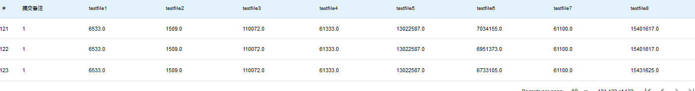

最后我想说编译在我心中不愧是oo的promax升级版，最后的最后献上我的巨巨巨型类图，从左至右依次为前端架构，中端架构，后端架构。

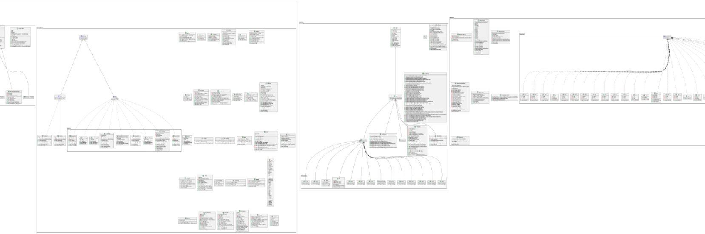

## 顺带实现了复写传播等优化

# 总结感想
